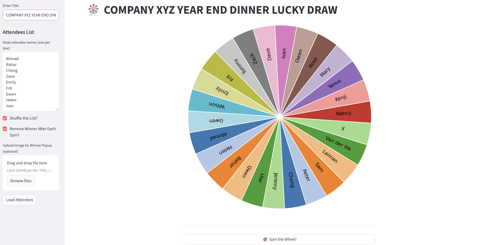

## Lucky Draw Wheel

A fun, interactive, and customizable spinning wheel application built with Streamlit. It's perfect for virtual events, team meetings, giveaways, or any situation where you need to randomly select a winner from a list.

The app features a dynamic wheel built with Matplotlib, a smooth spin animation, and a custom HTML/CSS winner popup.

### ✨ Features

- Dynamic Spinning Wheel: Visually displays all remaining attendees on a colorful wheel.
- Custom Attendee List: Simply paste your list of names into the sidebar.
- List Shuffling: Option to shuffle the attendee list before loading it onto the wheel.
- Remove Winners: Automatically removes the winner from the wheel after each spin (this can be disabled).
- Winner History: Keeps a running list of all winners drawn during the session.
- Custom Winner Popup: A sleek, custom HTML/CSS modal announces the winner.
- Custom Popup Image: Upload your own image (e.g., a company logo, a prize photo) to be displayed on the winner popup.
- Custom Title: Set your own title for the event in the sidebar.

### 🛠️ How to Run Locally

1. Clone the Repository

'''
git clone [https://github.com/shihjen/lucky_draw/-wheel.git](https://github.com/shihjen/lucky_draw_wheel.git)
cd your-repo-name
'''

2. Install Dependencies
It's highly recommended to use a Python virtual environment.

'''
# Create a virtual environment (optional but recommended)
python -m venv venv
source venv/bin/activate  # On Windows: venv\Scripts\activate

# Install the required packages
pip install -r requirements.txt
'''

You will need to create a requirements.txt file with the following content:

'''
streamlit
matplotlib
numpy
'''

3. Run the App
Once your dependencies are installed and local files are in place, run the following command:

'''
streamlit run app.py
'''

